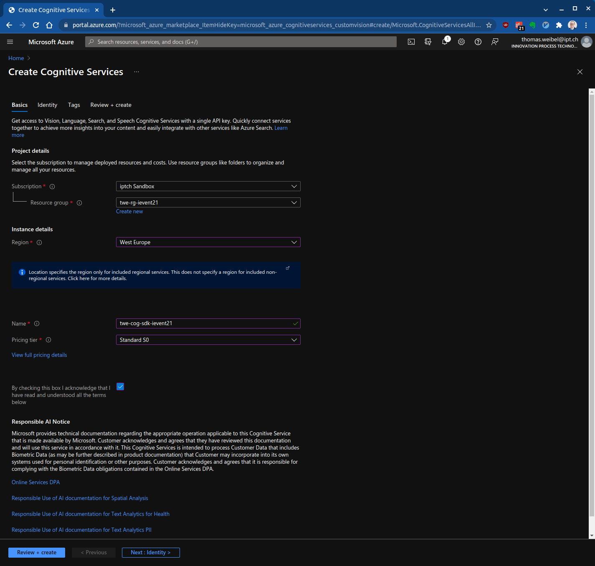
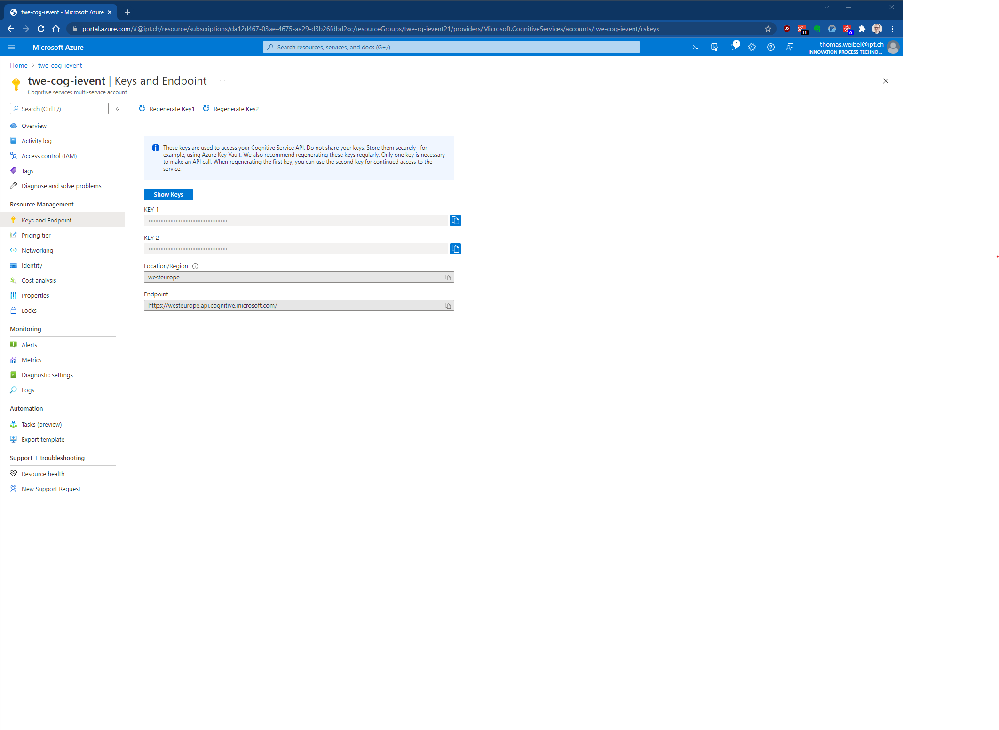
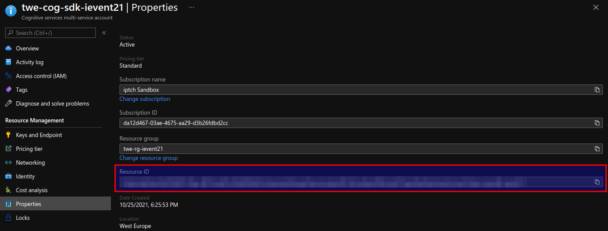

# Custom Vision: SDK

|                      |                                                    |            |
| -------------------- | -------------------------------------------------- | ---------- |
| **Fortgeschrittene** |  | 20 Minuten |

- [Einführung](#einführung)
- [Setup](#setup)
- [Python Applikation erstellen](#python-applikation-erstellen)
- [Code Snippets](#code-snippets)
  - [Authentifizierung des Clients](#authentifizierung-des-clients)
  - [Erstellen eines neuen Custom Vision Projekts](#erstellen-eines-neuen-custom-vision-projekts)
  - [Tags zum Projekt hinzufügen und Bilder hochladen](#tags-zum-projekt-hinzufügen-und-bilder-hochladen)
  - [Das Projekt trainieren](#das-projekt-trainieren)
  - [Die aktuelle Iteration veröffentlichen](#die-aktuelle-iteration-veröffentlichen)
  - [Den Prediction Endpoint testen](#den-prediction-endpoint-testen)
- [Die Applikation ausführen](#die-applikation-ausführen)
- [Referenzen](#referenzen)

## Einführung

In dieser Übung verwendest du das Custom Vision Python SDK, um ein Projekt zu erstellen, Tags hinzufügen, das Projekt zu trainieren und um es zu testen.

Als Beispiel kannst du die Bilder der Simpsons im [dataset](../dataset) Ordner benutzen.

## Setup

Für die Übung benötigst du [Python 3.x](https://www.python.org/) und [pip](https://pip.pypa.io/en/stable/).

Logge dich auf dem [Azure Portal](https://portal.azure.com/) ein und erstelle eine neue [Custom Vision Ressource](https://portal.azure.com/?microsoft_azure_marketplace_ItemHideKey=microsoft_azure_cognitiveservices_customvision#create/Microsoft.CognitiveServicesAllInOne) in der Region "West Europe".

Verwende folgende Naming Conventions und benutze dein ipt-Kürzel als Prefix:

| Asset Type         | Abkürzung | Beispiel             |
| ------------------ | --------- | -------------------- |
| Resource Group     | rg        | twe-rg-ievent21      |
| Cognitive Services | cog       | twe-cog-sdk-ievent21 |



Du brauchst folgende Informationen für den Python Code:

* Endpoint
* Training Key
* Prediction Key
* Prediction Resource ID

"Endpoint", "Training Key" und "Prediction Key" findest du unter "Keys and Enpoint":



Die "Prediction Resource ID" findest du unter "Properties":



Um eine Custom Vision Applikation in Python zu schreiben, benötigst du die Custom Vision Client Bibliothek:

```bash
pip install azure-cognitiveservices-vision-customvision
```

## Python Applikation erstellen

Erstelle eine neue Python Applikation und importiere die folgenden Bibliotheken:

```python
from azure.cognitiveservices.vision.customvision.training import CustomVisionTrainingClient
from azure.cognitiveservices.vision.customvision.prediction import CustomVisionPredictionClient
from azure.cognitiveservices.vision.customvision.training.models import ImageFileCreateBatch, ImageFileCreateEntry, Region
from msrest.authentication import ApiKeyCredentials
import os, time, uuid
```

Erstellen die Variablen für den Azure Endpoint und die Subscription Keys deiner Ressource (siehe [Setup](#setup))

```python
# Replace with valid values
ENDPOINT = "PASTE_YOUR_CUSTOM_VISION_TRAINING_ENDPOINT_HERE"
training_key = "PASTE_YOUR_CUSTOM_VISION_TRAINING_SUBSCRIPTION_KEY_HERE"
prediction_key = "PASTE_YOUR_CUSTOM_VISION_PREDICTION_SUBSCRIPTION_KEY_HERE"
prediction_resource_id = "PASTE_YOUR_CUSTOM_VISION_PREDICTION_RESOURCE_ID_HERE"
```

Vergiss nicht, die Schlüssel aus deinem Code zu entfernen, wenn du fertig bist, und sie niemals öffentlich zu publizieren (siehe [Azure Cognitive Services security](https://docs.microsoft.com/en-us/azure/cognitive-services/cognitive-services-security)).

## Code Snippets

### Authentifizierung des Clients

```python
credentials = ApiKeyCredentials(in_headers={"Training-key": training_key})
trainer = CustomVisionTrainingClient(ENDPOINT, credentials)
prediction_credentials = ApiKeyCredentials(
    in_headers={"Prediction-key": prediction_key})
predictor = CustomVisionPredictionClient(ENDPOINT, prediction_credentials)
```

### Erstellen eines neuen Custom Vision Projekts

```python
# Configure the iteration name
publish_iteration_name = "classifyModel"

credentials = ApiKeyCredentials(in_headers={"Training-key": training_key})
trainer = CustomVisionTrainingClient(ENDPOINT, credentials)

# Create a new project
print("Creating project...")
project_name = "The Simpsons Classifier (SDK)"
project = trainer.create_project(
    project_name,
    description="Classify your favorite characters from The Simpsons",
    domain_id="2e37d7fb-3a54-486a-b4d6-cfc369af0018",
    classification_type="Multiclass")
```

### Tags zum Projekt hinzufügen und Bilder hochladen

```python
base_image_location = os.path.join(os.path.dirname(
    __file__), "..", "dataset", "simpsons_dataset")

print("Adding images...")

image_list = []

for dir in os.listdir(base_image_location):
    # Create tags
    tag = trainer.create_tag(project.id, dir)

    for image_num in range(0, 100):
        file_name = f"pic_{str(image_num).zfill(4)}.jpg"
        with open(os.path.join(base_image_location, dir, file_name), "rb") as image_contents:
            image_list.append(ImageFileCreateEntry(
                name=file_name, contents=image_contents.read(), tag_ids=[tag.id]))

# Upload images in batches
for i in range(0, len(image_list), 64):
    batch = image_list[i:i+64]
    upload_result = trainer.create_images_from_files(
        project.id, ImageFileCreateBatch(images=batch))
    if not upload_result.is_batch_successful:
        print("Image batch upload failed.")
        for image in upload_result.images:
            print("Image status: ", image.status)
        exit(-1)
```

### Das Projekt trainieren

```python
print("Training...")
iteration = trainer.train_project(project.id)
while (iteration.status != "Completed"):
    iteration = trainer.get_iteration(project.id, iteration.id)
    print("Training status: " + iteration.status)
    print("Waiting 10 seconds...")
    time.sleep(10)
```

### Die aktuelle Iteration veröffentlichen

```python
trainer.publish_iteration(project.id, iteration.id,
                          publish_iteration_name, prediction_resource_id)
```

### Den Prediction Endpoint testen

```python
prediction_credentials = ApiKeyCredentials(
    in_headers={"Prediction-key": prediction_key})
predictor = CustomVisionPredictionClient(ENDPOINT, prediction_credentials)

test_image_location = os.path.join(os.path.dirname(
    __file__), "..", "dataset", "simpsons_testset")

with open(os.path.join(test_image_location, "maggie_simpson_0.jpg"), "rb") as image_contents:
    results = predictor.classify_image(
        project.id, publish_iteration_name, image_contents.read())

    # Display the results.
    for prediction in results.predictions:
        print("\t" + prediction.tag_name +
              ": {0:.2f}%".format(prediction.probability * 100))
```

## Die Applikation ausführen

[`custom_vision_sdk_exercise.py`](custom_vision_sdk_exercise.py) ist eine Beispielsapplikation und erstellt ein Modell zur Klassifizierung der Simpsons:

```bash
python custom_vision_sdk_exercise.py
```

Das Ausführen dauert circa 10 Minuten.

Auf der [Custom Vision Website](https://www.customvision.ai/projects) kannst du den Status von deinem Projekt anschauen.

## Referenzen

* [Custom Vision Dokumentation](https://docs.microsoft.com/en-us/azure/cognitive-services/custom-vision-service/)
* [The Simpsons Characters Data](https://www.kaggle.com/alexattia/the-simpsons-characters-dataset)
* [Prediction API](https://docs.microsoft.com/en-us/azure/cognitive-services/custom-vision-service/use-prediction-api)
* [Python Package (PyPI)](https://pypi.org/project/azure-cognitiveservices-vision-customvision/)
* [CustomVisionTrainingClient Class](https://docs.microsoft.com/en-us/python/api/azure-cognitiveservices-vision-customvision/azure.cognitiveservices.vision.customvision.training.customvisiontrainingclient?view=azure-python)
* [CustomVisionPredictionClient Class](https://docs.microsoft.com/en-us/python/api/azure-cognitiveservices-vision-customvision/azure.cognitiveservices.vision.customvision.prediction.customvisionpredictionclient?view=azure-python)
* [ImagePrediction Class](https://docs.microsoft.com/en-us/python/api/azure-cognitiveservices-vision-customvision/azure.cognitiveservices.vision.customvision.prediction.models.imageprediction?view=azure-python)
* [Select a domain for a Custom Vision project](https://docs.microsoft.com/en-us/azure/cognitive-services/custom-vision-service/select-domain)
* [Azure Cognitive Services security](https://docs.microsoft.com/en-us/azure/cognitive-services/cognitive-services-security)
