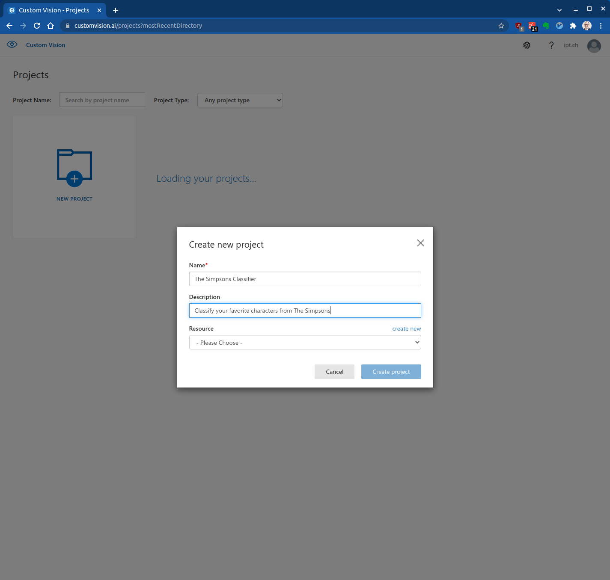
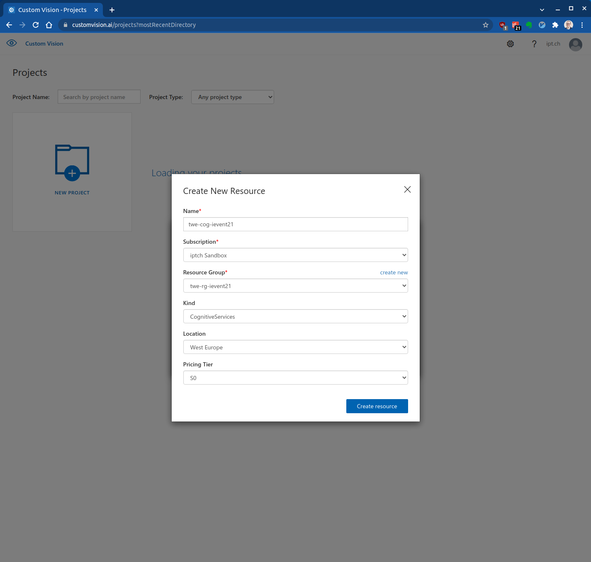
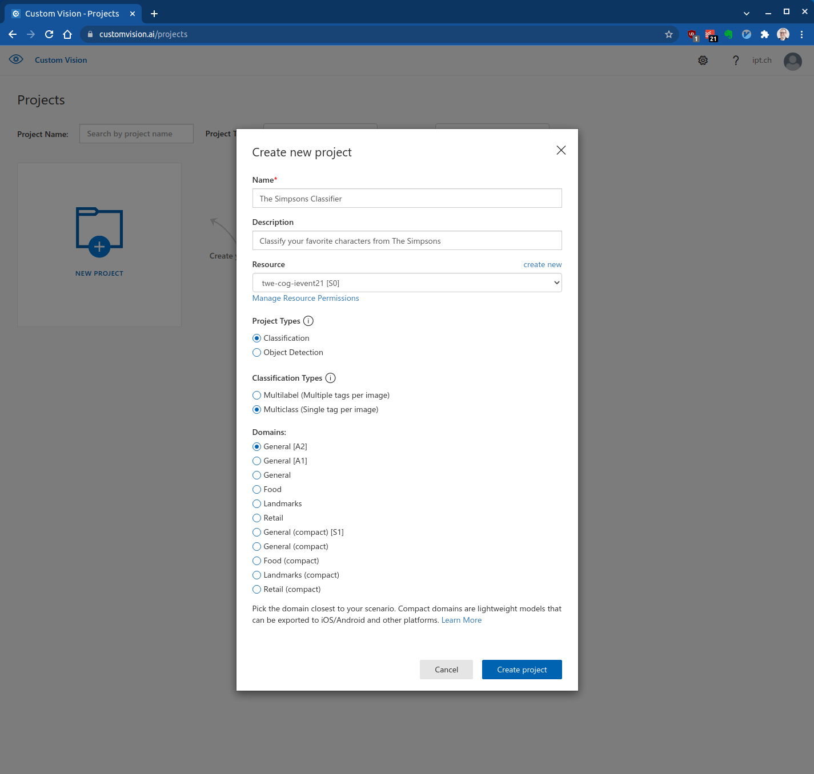
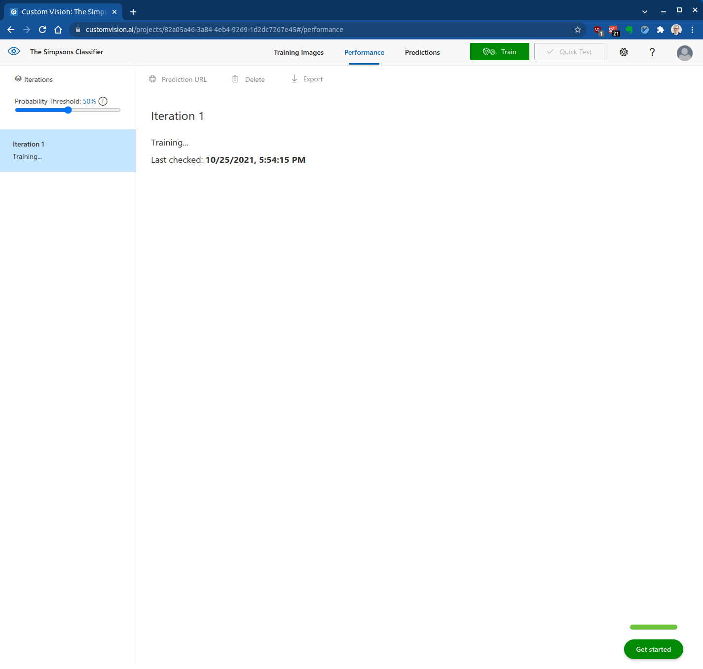
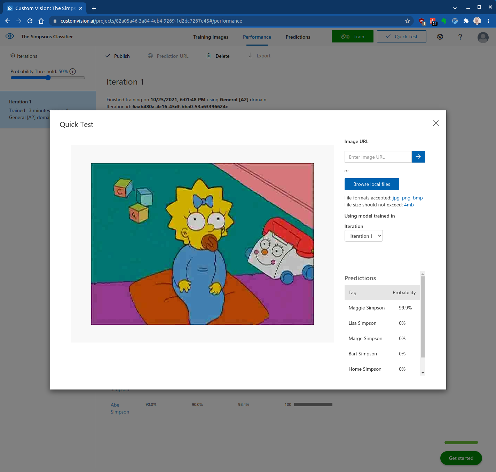

# Custom Vision: Website

|                |                                          |     |
| -------------- | ---------------------------------------- | --- |
| **Einsteiger** |  | 20 Minuten  |

- [Einführung](#einführung)
- [Projekt und Resource erstellen](#projekt-und-resource-erstellen)
- [Bilder hochladen und taggen](#bilder-hochladen-und-taggen)
- [Classifier trainieren und evaluieren](#classifier-trainieren-und-evaluieren)
- [Referenzen](#referenzen)

## Einführung

In dieser Übung erstellst du auf der Custom Vision Website ein Modell zur Bildklassifizierung. Sobald du ein Modell erstellt hast, kannst du es mit neuen Bildern testen.

Als Beispiel kannst du die Bilder der Simpsons im [dataset](../dataset) Ordner benutzen.

## Projekt und Resource erstellen

Gehe zur [Custom Vision Website](https://www.customvision.ai/) und logge dich mit deinen ipt Credentials ein:

Erstelle ein neues Projekt:

Erstelle eine neue Custom Vision Ressource. Dazu musst du zuerst eine neue Resource Group in "West Europe" erstellen und dann die neue Custom Vision Resource dieser Gruppe zuweisen.

Verwende folgende Naming Conventions und benutze dein ipt-Kürzel als Prefix:

| Asset Type         | Abkürzung | Beispiel         |
| ------------------ | --------- | ---------------- |
| Resource Group     | rg        | twe-rg-ievent21  |
| Cognitive Services | cog       | twe-cog-ievent21 |

Danach kannst du den Projekttyp, Klassifizierungstyp und die [Domain](https://docs.microsoft.com/en-us/azure/cognitive-services/custom-vision-service/select-domain) konfigurieren:

## Bilder hochladen und taggen

Nun können Bilder hochgeladen und getaggt werden:

## Classifier trainieren und evaluieren

Nachdem die Bilder hochgeladen und getaggt wurden, kann das Modell trainiert werden:

Das Training dauert circa 10 Minuten:

Wenn das Training fertig ist, zeigt Custom Vision Precision, Recall und die Performance:

Am einfachsten kannst du das Modell mit dem "Quick Test" ausprobieren:

## Referenzen

* [Custom Vision Dokumentation](https://docs.microsoft.com/en-us/azure/cognitive-services/custom-vision-service/)
* [The Simpsons Characters Data](https://www.kaggle.com/alexattia/the-simpsons-characters-dataset)
* [Prediction API](https://docs.microsoft.com/en-us/azure/cognitive-services/custom-vision-service/use-prediction-api)
* [Custom Vision Domains](https://docs.microsoft.com/en-us/azure/cognitive-services/custom-vision-service/select-domain)
