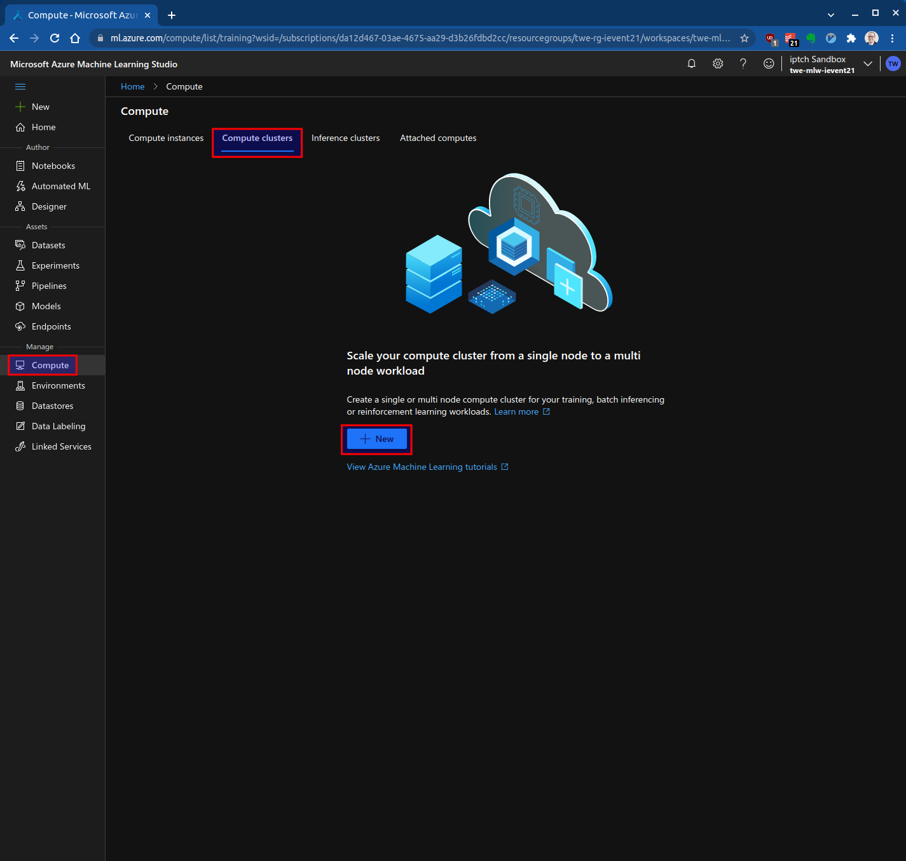
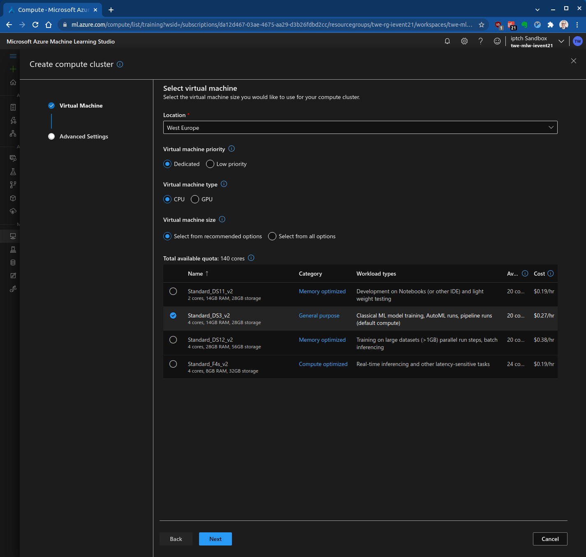

# Azure Machine Learning: Automated ML

|              |                                  |
| ------------ | -------------------------------- |
| **Einsteiger** |  |

- [Einführung](#einführung)
- [Setup](#setup)
- [Compute Cluster erstellen](#compute-cluster-erstellen)
- [Erstellen eines Datensatzes](#erstellen-eines-datensatzes)
- [AutoML ausführen](#automl-ausführen)
- [Das beste Modell deployen](#das-beste-modell-deployen)
- [Referenzen](#referenzen)

## Einführung

In dieser Übung trainierst du ein Predictive Machine Learning Modell. Du verwendest automatisiertes maschinelles Lernen (AutoML) in Azure Machine Learning Studio ohne Code schreiben zu müssen. AutoML automatisiert die Datenaufbereitung und das Modelltraining vollständig.
 
## Setup

Du brauchst einen Azure Machine Learning Workspace. Falls du noch keinen erstellt hast, findest du auf [Create and manage Azure Machine Learning workspaces](https://docs.microsoft.com/en-us/azure/machine-learning/how-to-manage-workspace?tabs=azure-portal#create-a-workspace) eine Anleitung dazu.

Öffne das [Microsoft Azure Machine Learning Studio](https://ml.azure.com/) und [erstelle einen neuen Workspace](https://portal.azure.com/#create/Microsoft.MachineLearningServices). Verwende folgende Naming Conventions und benutze dein ipt-Kürzel als Prefix:

| Asset Type                       | Abkürzung | Beispiel          |
| -------------------------------- | --------- | ----------------- |
| Resource Group                   | rg        | twe-rg-ievent21   |
| Azure Machine Learning Workspace | mlw       | twe-mlw-ievent21  |
| Storage Account                  | st        | twestievent21     |
| Key vault                        | kv        | twe-kv-ievent21   |
| Application Insights             | appi      | twe-appi-ievent21 |
| Container Registry               | cr        | twecrievent21     |
| Container Registry               | cr        | twecrievent21     |

## Compute Cluster erstellen

Beim automatisierten maschinellen Lernen werden viele maschinelle Lernmodelle trainiert, um den "besten" Algorithmus und die besten Parameter zu finden. Azure Machine Learning parallelisiert die Ausführung des Modelltrainings über einen Compute-Cluster.

Um zu beginnen, wähle im [Azure Machine Learning Studio ](https://ml.azure.com/) im Menü auf der linken Seite "Compute", öffne die Registerkarte "Compute clusters" und klicke auf "New":

Der neue Cluster hat 0 Nodes, es fallen also keine Rechenkosten an. Es entstehen nur dann Kosten, wenn der Auftrag für automatisiertes maschinelles Lernen ausgeführt wird. Der Cluster wird nach 30 Minuten Leerlaufzeit automatisch auf 0 zurückgesetzt.

## Erstellen eines Datensatzes

TODO

## AutoML ausführen

TODO

## Das beste Modell deployen

TODO

## Referenzen

* [Azure Machine Learning documentation](https://docs.microsoft.com/en-us/azure/machine-learning/)
* [Manage Azure Machine Learning workspaces in the portal or with the Python SDK](https://docs.microsoft.com/en-us/azure/machine-learning/how-to-manage-workspace?tabs=azure-portal)
* [Diabetes Data](https://www4.stat.ncsu.edu/~boos/var.select/diabetes.html)
* [Consume an Azure Machine Learning model deployed as a web service](https://docs.microsoft.com/en-us/azure/machine-learning/how-to-consume-web-service?tabs=python)
