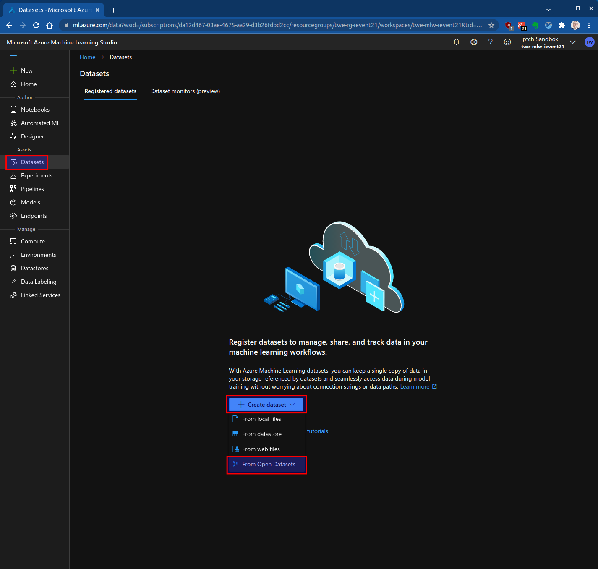
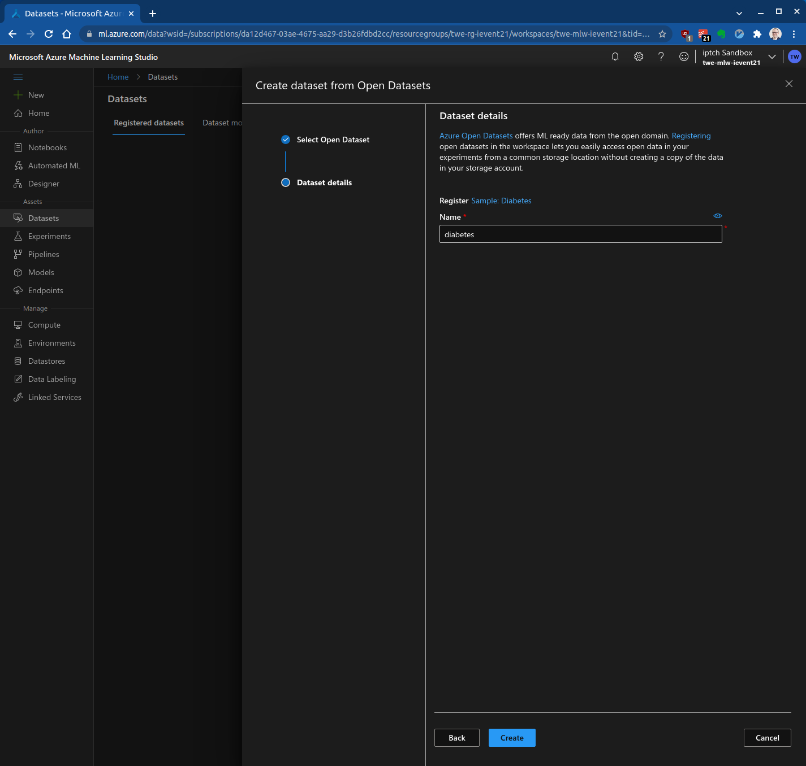
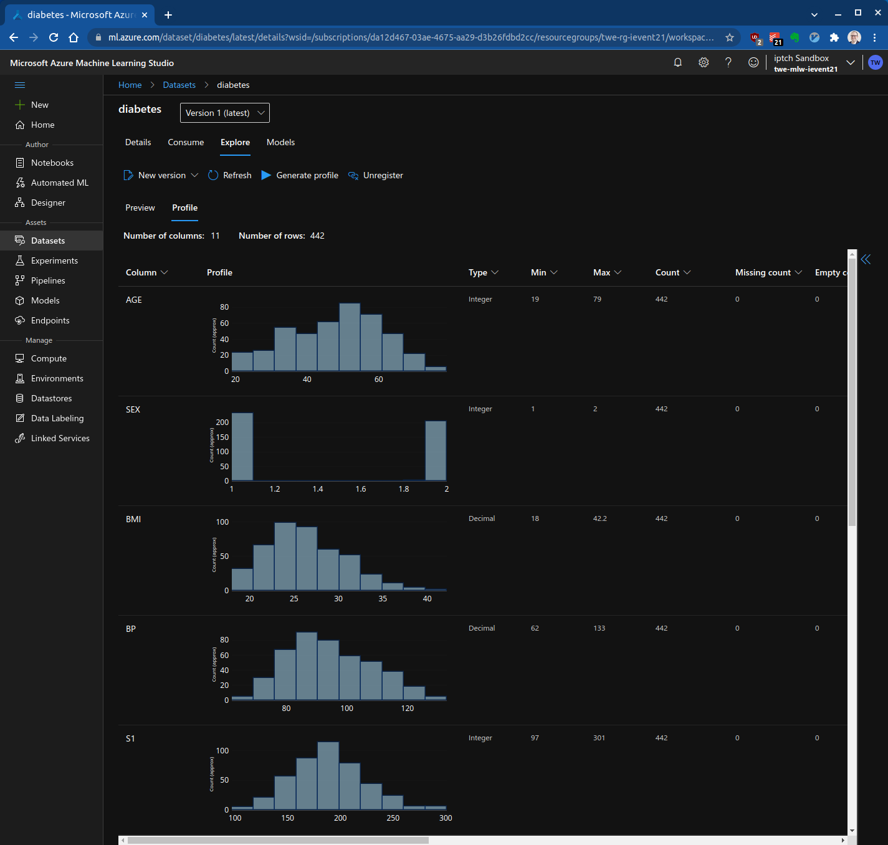
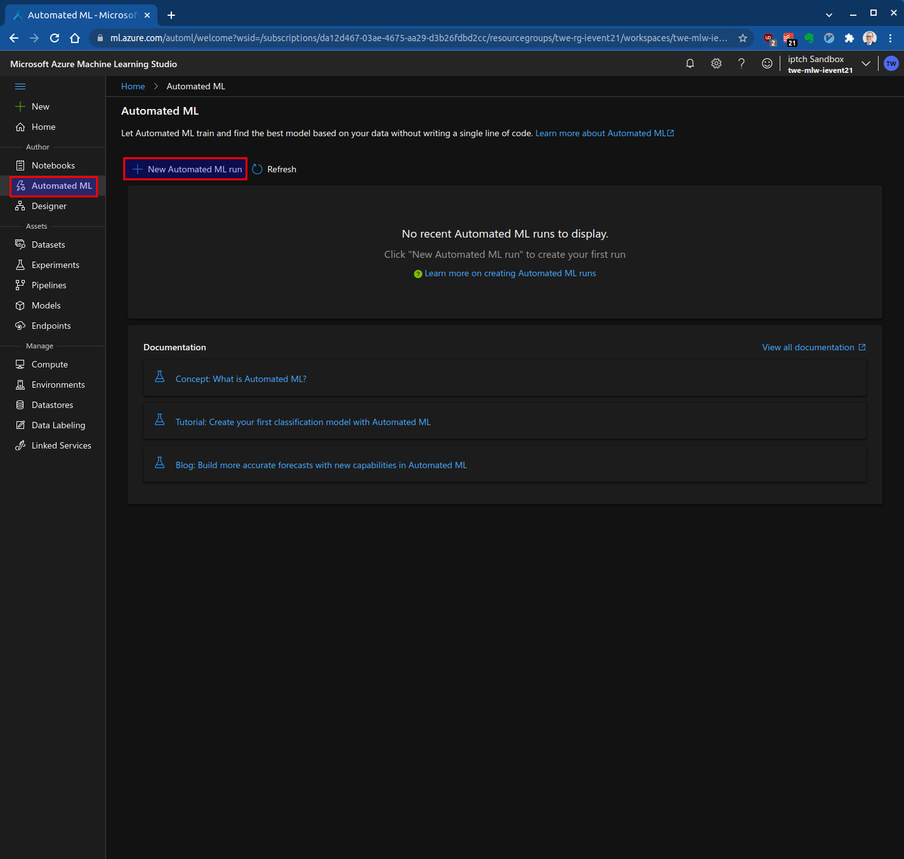
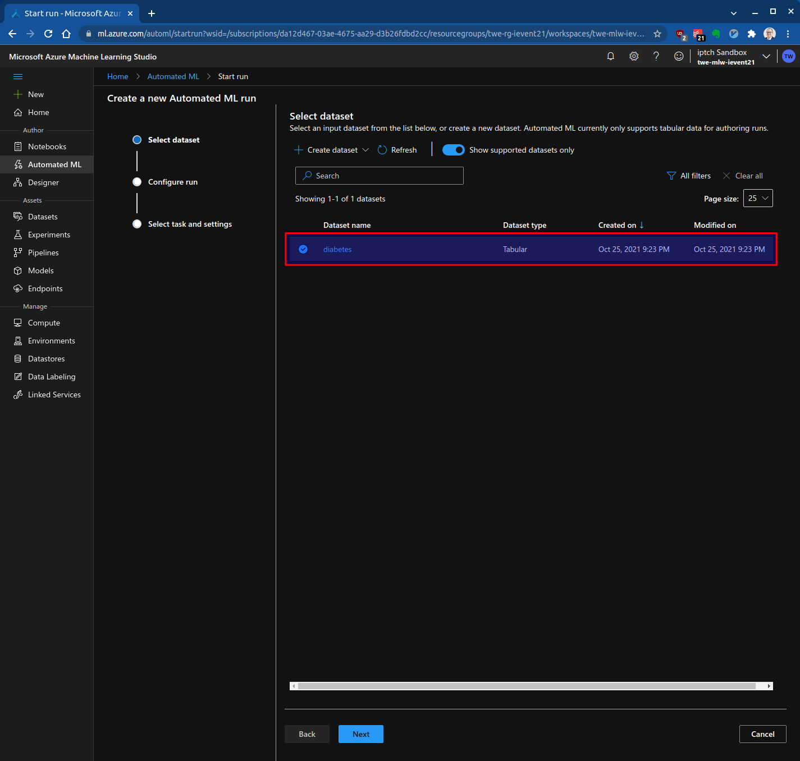
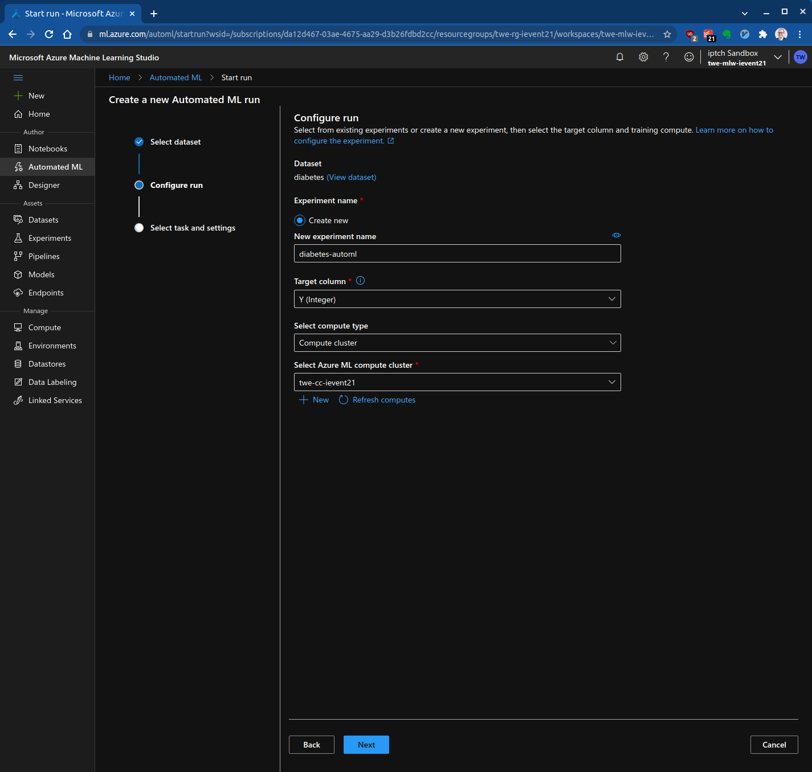
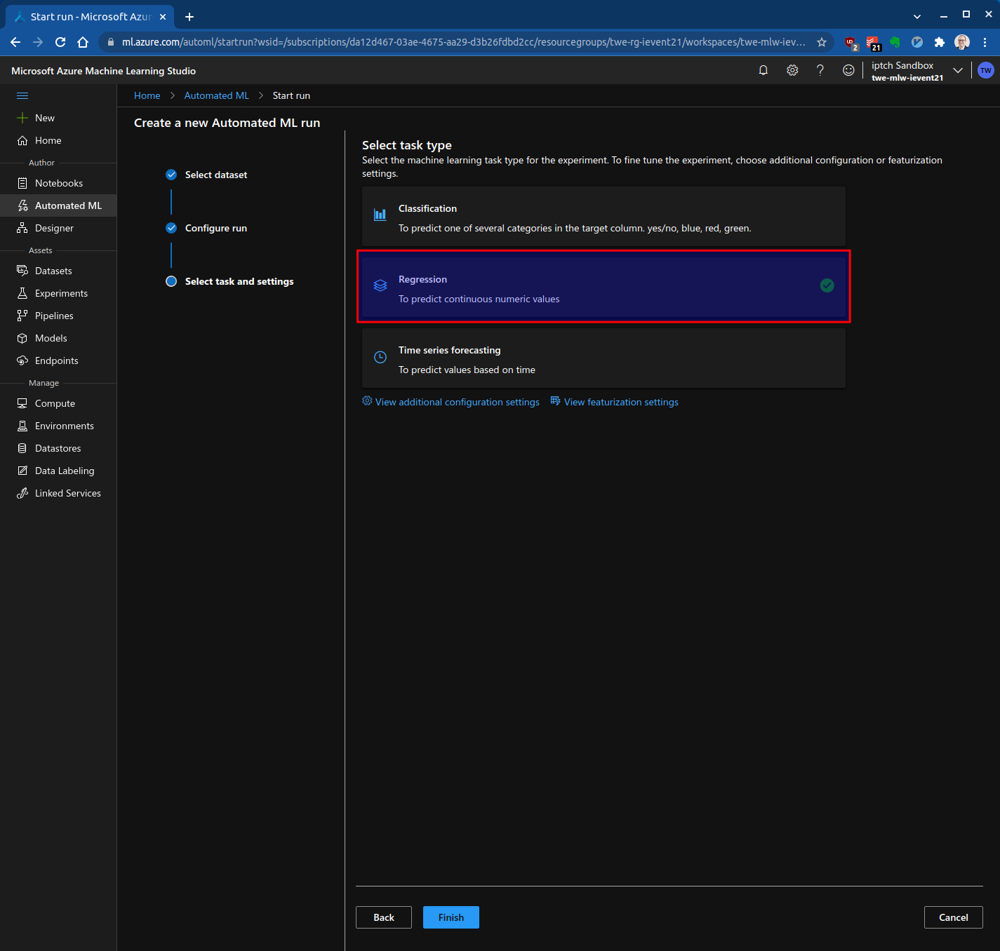
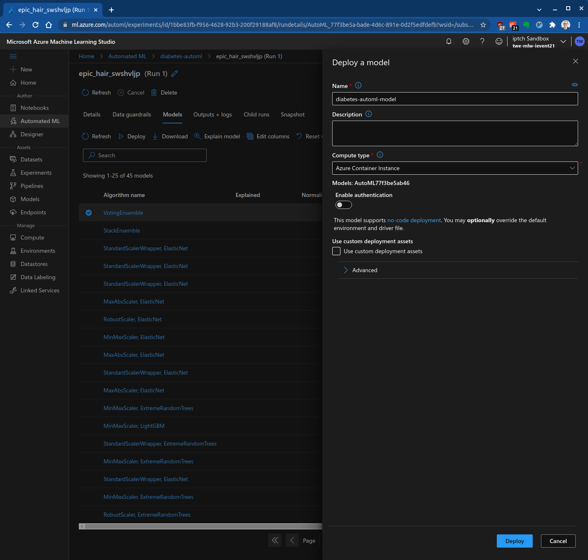

# Azure Machine Learning: Automated ML

|              |                                  |
| ------------ | -------------------------------- |
| **Einsteiger** |  |

- [Einführung](#einführung)
- [Setup](#setup)
- [Compute Cluster erstellen](#compute-cluster-erstellen)
- [Erstellen eines Datensets](#erstellen-eines-datensets)
- [AutoML ausführen](#automl-ausführen)
- [Das beste Modell deployen](#das-beste-modell-deployen)
- [Das Modell als Webservice aufrufen](#das-modell-als-webservice-aufrufen)
- [Referenzen](#referenzen)

## Einführung

In dieser Übung trainierst du ein Predictive Machine Learning Modell mit AutoML. AutoML automatisiert die Datenaufbereitung und das Modelltraining vollständig ohne Code schreiben zu müssen.

Du lernst dabei folgendes:

* Erstellen eines Azure Machine Learning Compute Clusters
* Erstellen eines Datensatzes
* Ausführen von AutoML
* Bereitstellung des besten Modells als Webservice
* Aufrufen des Modells
 
## Setup

Du brauchst einen Azure Machine Learning Workspace. Falls du noch keinen erstellt hast, findest du auf [Create and manage Azure Machine Learning workspaces](https://docs.microsoft.com/en-us/azure/machine-learning/how-to-manage-workspace?tabs=azure-portal#create-a-workspace) eine Anleitung dazu.

Öffne das [Microsoft Azure Machine Learning Studio](https://ml.azure.com/) und [erstelle einen neuen Workspace](https://portal.azure.com/#create/Microsoft.MachineLearningServices). Verwende folgende Naming Conventions und benutze dein ipt-Kürzel als Prefix:

| Asset Type                       | Abkürzung | Beispiel          |
| -------------------------------- | --------- | ----------------- |
| Resource Group                   | rg        | twe-rg-ievent21   |
| Azure Machine Learning Workspace | mlw       | twe-mlw-ievent21  |
| Storage Account                  | st        | twestievent21     |
| Key vault                        | kv        | twe-kv-ievent21   |
| Application Insights             | appi      | twe-appi-ievent21 |
| Container Registry               | cr        | twecrievent21     |


## Compute Cluster erstellen

Beim automatisierten maschinellen Lernen werden viele maschinelle Lernmodelle trainiert, um den besten Algorithmus und die besten Parameter zu finden. Azure Machine Learning parallelisiert die Ausführung des Modelltrainings über einen Compute-Cluster.

Um zu beginnen, wähle im [Azure Machine Learning Studio ](https://ml.azure.com/) im Menü auf der linken Seite "Compute", öffne die Registerkarte "Compute clusters" und klicke auf "New":


Der neue Cluster hat 0 Nodes, es fallen also keine Rechenkosten an. Es entstehen nur dann Kosten, wenn der Auftrag für automatisiertes maschinelles Lernen ausgeführt wird. Der Cluster wird nach 30 Minuten Leerlaufzeit automatisch auf 0 zurückgesetzt.

## Erstellen eines Datensets

In dieser Übung verwenden wir das Diabetes-Dataset. Dieses Datenset ist Teil der [Azure Open Datasets](https://azure.microsoft.com/en-us/services/open-datasets/#overview).

Um das Dataset zu erstellen, öffne im Menü auf der linken Seite "Dataset", klicke auf "Create dataset" und wähle "From Open Dataset" aus:



Selektiere "Sample: Diabetes" und erstelle ein neues Dataset basierend darauf mit dem Name "diabetes":




Um die Daten zu erkunden, wähle den Datensatz aus und öffne "Explore":



Die Daten enthalten 10 Inputvariablen für die Ausgangssituation, wie Alter, Geschlecht, Body-Mass-Index, durchschnittlicher Blutdruck und sechs Blutserum-Messungen. Ausserdem gibt es eine Zielvariable mit der Bezeichnung Y. Diese Zielvariable ist ein quantitatives Mass für die Diabetesentwicklung ein Jahr nach der Ausgangssituation.

## AutoML ausführen

Erstelle einen neuen AutoML-Lauf im "Automated ML" Menü:



Wähle das Diabetes Dataset aus:



Erstelle ein neues Experiment und wähle "Y" als Zielvariable:



Wähle "Regression" als Task Type:



AutoML benötigt etwa eine Stunde, um das Training der 100 Modelle abzuschliessen. Du musst nicht bis zum Schluss warten und kannst auch vor dem Abschluss eines der Modelle deployen.

## Das beste Modell deployen

Unter der Registerkarte "Models" sieht man alle Modelle, die ausprobiert wurden. Die Modelle sind nach Performance geordnet und das Modell mit der besten Performance wird zuerst angezeigt:


Wähle das beste Modell und klicke "Deploy", um das Fenster "Deploy a model" zu öffnen:



Nach dem Klicken auf "Deploy", solltest du eine Meldung sehen, dass das Modell erfolgreich bereitgestellt wurde.

## Das Modell als Webservice aufrufen

Unter "Endpoints" findest du das "diabetes-model" und den entsprechenden REST Endpoint:


Zum Aufrufen kannst du zum Beispiel `curl` verwenden:

```bash
#!/usr/bin/env bash

ENDPOINT=<ENDPOINT>

curl -d '{
    "data": [
        {
            "AGE": 42,
            "SEX": 1,
            "BMI": 28.7,
            "BP": 102.3,
            "S1": 199,
            "S2": 89.0,
            "S3": 42.0,
            "S4": 5.0,
            "S5": 5.6789,
            "S6": 99
        }
    ]
}'\
    -H "Content-Type: application/json" \
    -X POST $ENDPOINT
```

## Referenzen

* [Azure Machine Learning documentation](https://docs.microsoft.com/en-us/azure/machine-learning/)
* [Manage Azure Machine Learning workspaces in the portal or with the Python SDK](https://docs.microsoft.com/en-us/azure/machine-learning/how-to-manage-workspace?tabs=azure-portal)
* [Diabetes Data](https://www4.stat.ncsu.edu/~boos/var.select/diabetes.html)
* [Consume an Azure Machine Learning model deployed as a web service](https://docs.microsoft.com/en-us/azure/machine-learning/how-to-consume-web-service?tabs=python)
