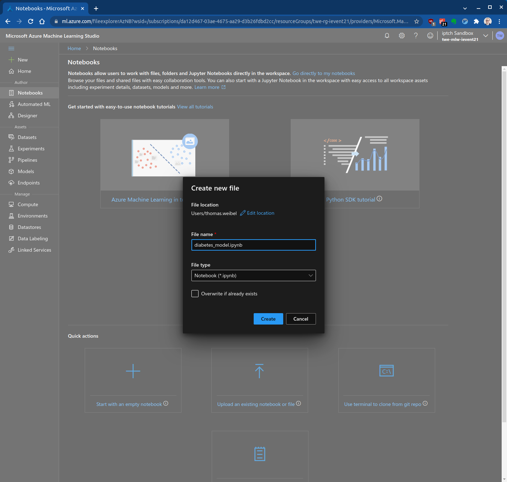
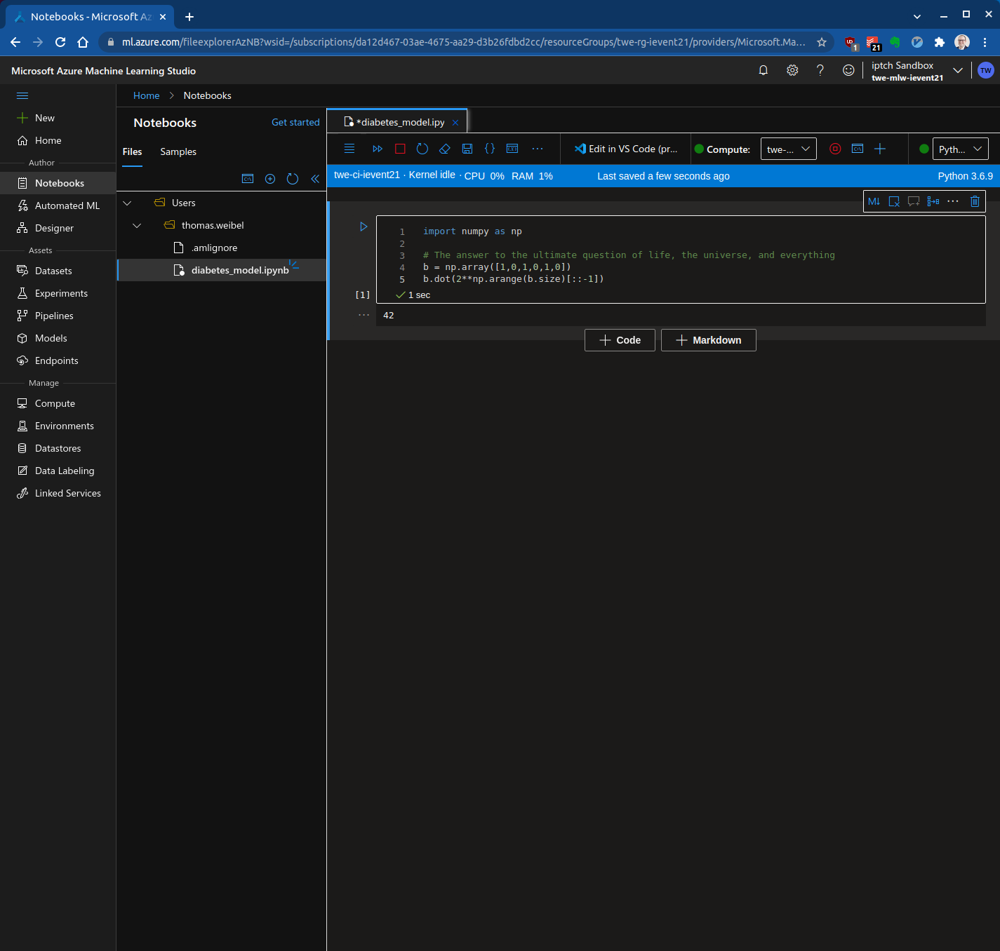
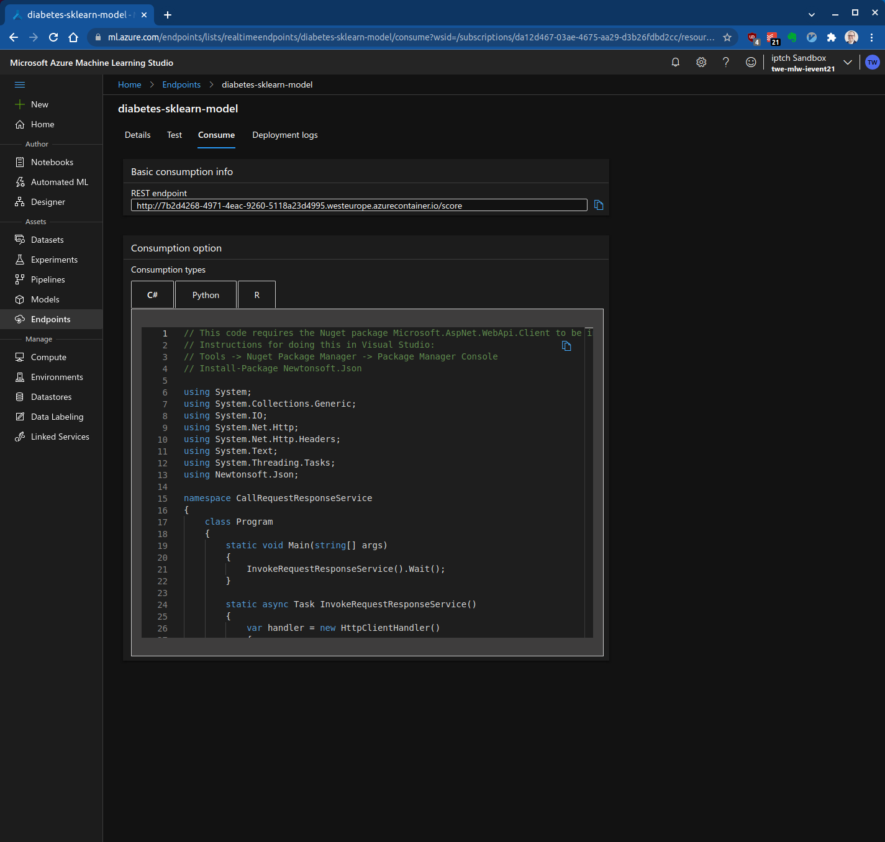

# Azure Machine Learning: Code

|              |                                      |            |
| ------------ | ------------------------------------ | ---------- |
| **Experten** |  | 60 Minuten |

- [Einführung](#einführung)
- [Setup](#setup)
- [Notebook und Compute Instanz erstellen](#notebook-und-compute-instanz-erstellen)
- [Erstellen eines Modells mit scikit-learn](#erstellen-eines-modells-mit-scikit-learn)
  - [Daten importieren](#daten-importieren)
  - [Modell trainieren](#modell-trainieren)
  - [Modell registrieren](#modell-registrieren)
- [Modell als Web Service bereitstellen](#modell-als-web-service-bereitstellen)
  - [Modell Scoring Script](#modell-scoring-script)
  - [Definiere das benutzerdefinierte Environment](#definiere-das-benutzerdefinierte-environment)
  - [Model deployen](#model-deployen)
  - [Web Service testen](#web-service-testen)
- [Referenzen](#referenzen)

## Einführung

In dieser Übung trainierst du ein Predictive Machine Learning Modell mit Python Code in einem Jupyter Notebook.

Du lernst dabei folgendes:

* Erstellen eines Jupyter Notebooks
* Erstellen einer Azure Machine Learning Compute Instanz
* Trainieren eines Regressionsmodells mit scikit-learn
* Erstellen eines Scoring-Skripts
* Bereitstellung des Modells als Web Service
* Aufrufen des Modells als Web Service

## Setup

Du brauchst einen Azure Machine Learning Workspace. Falls du noch keinen erstellt hast, findest du in der [AutoML Anleitung](../auto_ml/README.md#setup) mehr Informationen dazu.

## Notebook und Compute Instanz erstellen

Melde dich beim [Azure Machine Learning Studio](https://ml.azure.com/) an und wähle im Menü auf der linken Seite "Notebooks" und dann "Start with an empty notebook":



Falls noch keine Compute Instanz existiert, muss eine erstellt werden. Klicke dazu auf das Plus-Symbol am oberen Rand des Notebooks:


Mehr Informationen dazu findest du in der [Designer Anleitung](../designer/README.md#erstellen-einer-compute-instanz).

Die Bereitstellung der Recheninstanz kann 2 bis 4 Minuten in Anspruch nehmen.

Nachdem die Recheninstanz bereitgestellt wurde, kannst du das Notebook verwenden, um Codezellen auszuführen:

```python
import numpy as np

# The answer to the ultimate question of life, the universe, and everything
b = np.array([1,0,1,0,1,0])
b.dot(2**np.arange(b.size)[::-1])
```

Drücke dann Shift + Enter, Control + Enter oder klicke "Run cell":



## Erstellen eines Modells mit scikit-learn

In diesem Tutorial verwendest du das Diabetes Dataset von [Azure Open Datasets](https://azure.microsoft.com/en-us/services/open-datasets/#overview).

### Daten importieren

Um die Daten zu importieren, kopiere den folgenden Code und füge ihn in eine neue Codezelle in deinem Notebook ein:

```python
from azureml.opendatasets import Diabetes

diabetes = Diabetes.get_tabular_dataset()
X = diabetes.drop_columns("Y")
y = diabetes.keep_columns("Y")
X_df = X.to_pandas_dataframe()
y_df = y.to_pandas_dataframe()
X_df.info()
```

Der Pandas Data Frame `X_df` enthält 10 Inputvariablen für die Ausgangssituation, wie Alter, Geschlecht, Body-Mass-Index, durchschnittlicher Blutdruck und sechs Blutserum-Messungen.

Der Pandas Data Frame `y_df` ist die Zielvariable. Diese Zielvariable ist ein quantitatives Mass für die Diabetesentwicklung ein Jahr nach der Ausgangssituation.

### Modell trainieren

Erstelle eine neue Codezelle  und füge den folgenden Code ein:


```python
import joblib
from sklearn.linear_model import Ridge

model = Ridge().fit(X_df,y_df)
joblib.dump(model, 'diabetes_sklearn_model.pkl')
```

Dieses Codeschnipsel konstruiert ein [Ridge-Regressionsmodell](https://scikit-learn.org/stable/modules/linear_model.html#ridge-regression) und serialisiert das Modell mit Hilfe des [Python-Pickel-Formats](https://docs.python.org/3/library/pickle.html).

### Modell registrieren

Neben dem Inhalt der Modelldatei selbst speichert ein registriertes Modell auch Metadaten. Zu den Metadaten gehören die Modellbeschreibung, Tags und Framework-Informationen.

Metadaten sind nützlich, um Modelle im Workspace zu verwalten und bereitzustellen.

Kopieren den folgenden Code und fügen ihn in eine neue Code-Zelle in deinem Notebook ein, um das Modell zusammen mit den Metadaten zu registrieren:

```python
import sklearn

from azureml.core import Workspace
from azureml.core import Model
from azureml.core.resource_configuration import ResourceConfiguration

ws = Workspace.from_config()

model = Model.register(
    workspace=ws,
    model_name='diabetes-sklearn-model',         # Name of the registered model in your workspace.
    model_path='./diabetes_sklearn_model.pkl',    # Local file to upload and register as a model.
    model_framework=Model.Framework.SCIKITLEARN,    # Framework used to create the model.
    model_framework_version=sklearn.__version__,    # Version of scikit-learn used to create the model.
    sample_input_dataset=X,
    sample_output_dataset=y,
    resource_configuration=ResourceConfiguration(cpu=2, memory_in_gb=4),
    description='Ridge regression model to predict diabetes progression.',
    tags={'area': 'diabetes', 'type': 'regression'}
)

print('Name:', model.name)
print('Version:', model.version)
```

Du kannst das Modell auch im Azure Machine Learning Studio unter "Models" anzeigen:


## Modell als Web Service bereitstellen

Um ein Modell für einen Web Service bereitzustellen, müssen ein Scoring Skript und ein benutzerdefiniertes Environment definiert werden. 

### Modell Scoring Script

Das Scoring-Skript enthält zwei Methoden:

* Die Methode `init()` wird beim Starten des Services ausgeführt. Sie lädt das Modell (das automatisch aus der Modellregistrierung heruntergeladen wird) und deserialisiert es.
* Die Methode `run(data)` wird ausgeführt, wenn ein Aufruf des Services Eingabedaten enthält, die ausgewertet werden müssen.

Kopiere den folgenden Code und fügen ihn in eine neue Codezelle in deinem Notebook ein. Das Codeschnipsel hat eine "Cell Magic", die den Code in eine Datei namens `score.py` schreibt.

```python
%%writefile score.py

import json
import pickle
import numpy as np
import pandas as pd
import os
import joblib
from azureml.core.model import Model

from inference_schema.schema_decorators import input_schema, output_schema
from inference_schema.parameter_types.numpy_parameter_type import NumpyParameterType
from inference_schema.parameter_types.pandas_parameter_type import PandasParameterType


def init():
    global model
    # Replace filename if needed.
    path = os.getenv('AZUREML_MODEL_DIR') 
    model_path = os.path.join(path, 'diabetes_sklearn_model.pkl')
    # Deserialize the model file back into a sklearn model.
    model = joblib.load(model_path)


input_sample = pd.DataFrame(data=[{
    "AGE": 5,
    "SEX": 2,
    "BMI": 3.1,
    "BP": 3.1,
    "S1": 3.1,
    "S2": 3.1,
    "S3": 3.1,
    "S4": 3.1,
    "S5": 3.1,
    "S6": 3.1
}])

# This is an integer type sample. Use the data type that reflects the expected result.
output_sample = np.array([0])

# To indicate that we support a variable length of data input,
# set enforce_shape=False
@input_schema('data', PandasParameterType(input_sample))
@output_schema(NumpyParameterType(output_sample))
def run(data):
    try:
        print("input_data....")
        print(data.columns)
        print(type(data))
        result = model.predict(data)
        print("result.....")
        print(result)

        # You can return any data type, as long as it can be serialized by JSON.
        return result.tolist()
    except Exception as e:
        error = str(e)
        return error
```

### Definiere das benutzerdefinierte Environment

Als nächstes definierst du das Environment für die Bewertung des Modells. Definiere im Environment die Python Pakete, wie z. B. `pandas` und `scikit-learn`, die das Scoring Script (`score.py`) benötigt.

Um das Environment zu definieren, kopiere den folgenden Code und fügen ihn in eine neue Zelle in deinem Notebook ein:

```python
from azureml.core.model import InferenceConfig
from azureml.core import Environment
from azureml.core.conda_dependencies import CondaDependencies

environment = Environment('diabetes-sklearn-environment')
environment.python.conda_dependencies = CondaDependencies.create(pip_packages=[
    'azureml-defaults',
    'inference-schema[numpy-support]',
    'joblib',
    'numpy',
    'pandas',
    'scikit-learn=={}'.format(sklearn.__version__)
])

inference_config = InferenceConfig(entry_script='./score.py',environment=environment)
```

### Model deployen

Um das Modell zu deployen, kopiere den folgenden Code und füge ihn in eine neue Zelle in deinem Notebook ein:

```python
service_name = 'diabetes-sklearn-model'

service = Model.deploy(ws, service_name, [model], inference_config, overwrite=True)
service.wait_for_deployment(show_output=True)
```

Die Bereitstellung des Services kann bis zu 10 Minuten dauern.

Wenn der Service erfolgreich bereitgestellt wurde, sollte folgendes angezeigt werden:

```
Tips: You can try get_logs(): https://aka.ms/debugimage#dockerlog or local deployment: https://aka.ms/debugimage#debug-locally to debug if deployment takes longer than 10 minutes.
Running......................................................................................
Succeeded
ACI service creation operation finished, operation "Succeeded"
```

### Web Service testen

Es wird empfohlen den Web Service zu testen, um sicherzustellen, dass er wie erwartet funktioniert. Kopiere en folgenden Code und füge ihn in eine neue Codezelle in deinem Notebook ein, um den Service zu testen:

```python
import json

input_payload = json.dumps({
    'data': X_df[0:2].values.tolist()
})

output = service.run(input_payload)

print(output)
```

Der Output sollte wie die folgende Python Liste aussehen:

```python
[[205.59094435613133], [68.84146418576978]]
```

Du kannst den Service auch im Azure Machine Learning Studio anzeigen. Gehe dazu im Menü auf der linken Seite zu "Endpoints":


Du kannst den Web Service in der Registerkarte "Test" testen:


Um den Service aufzurufen, benötigst du die Informationen in der Registerkarte "Consume":



Hier findest du auch Beispielcode in C#, Python und R.

## Referenzen

* [Azure Machine Learning documentation](https://docs.microsoft.com/en-us/azure/machine-learning/)
* [Manage Azure Machine Learning workspaces in the portal or with the Python SDK](https://docs.microsoft.com/en-us/azure/machine-learning/how-to-manage-workspace?tabs=azure-portal)
* [Diabetes Data](https://www4.stat.ncsu.edu/~boos/var.select/diabetes.html)
* [Consume an Azure Machine Learning model deployed as a web service](https://docs.microsoft.com/en-us/azure/machine-learning/how-to-consume-web-service?tabs=python)
* [Ridge regression and classification](https://scikit-learn.org/stable/modules/linear_model.html#ridge-regression)
* [sklearn.linear_model.Ridge](https://scikit-learn.org/stable/modules/generated/sklearn.linear_model.Ridge.html)
* [pickle — Python object serialization](https://docs.python.org/3/library/pickle.html)
* [Using Pickle](https://wiki.python.org/moin/UsingPickle)
