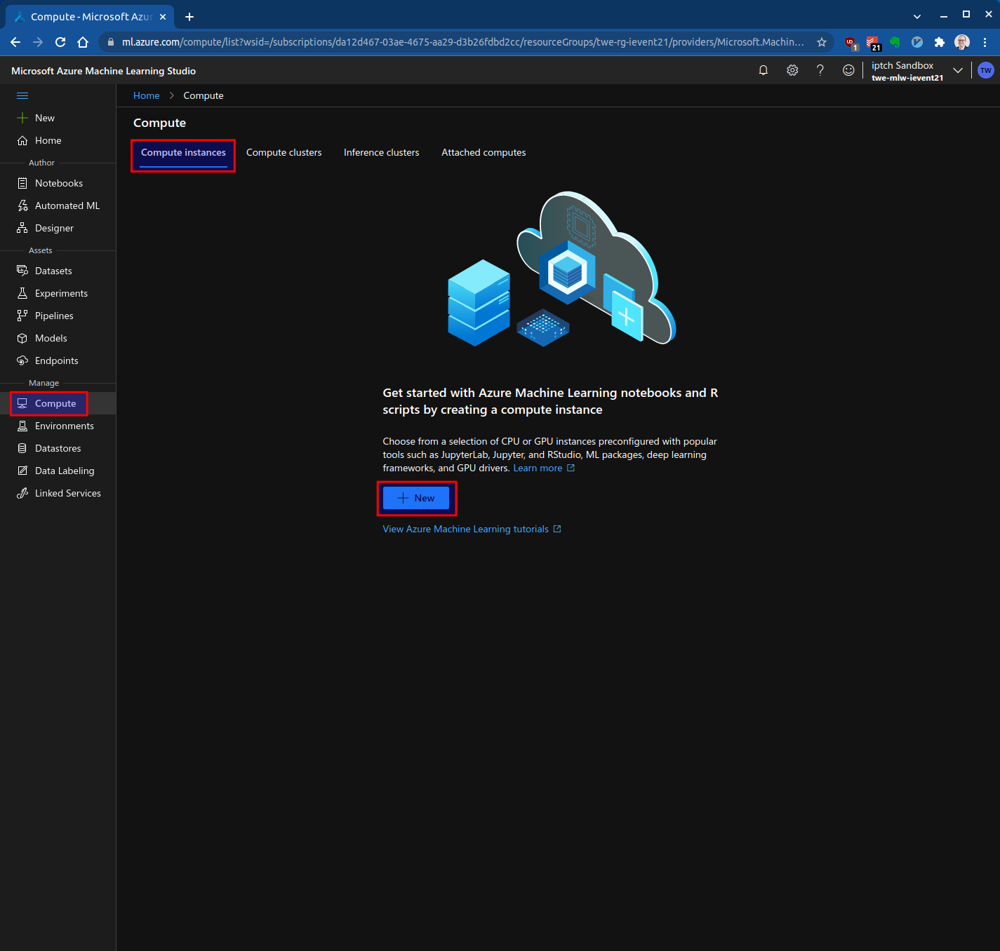
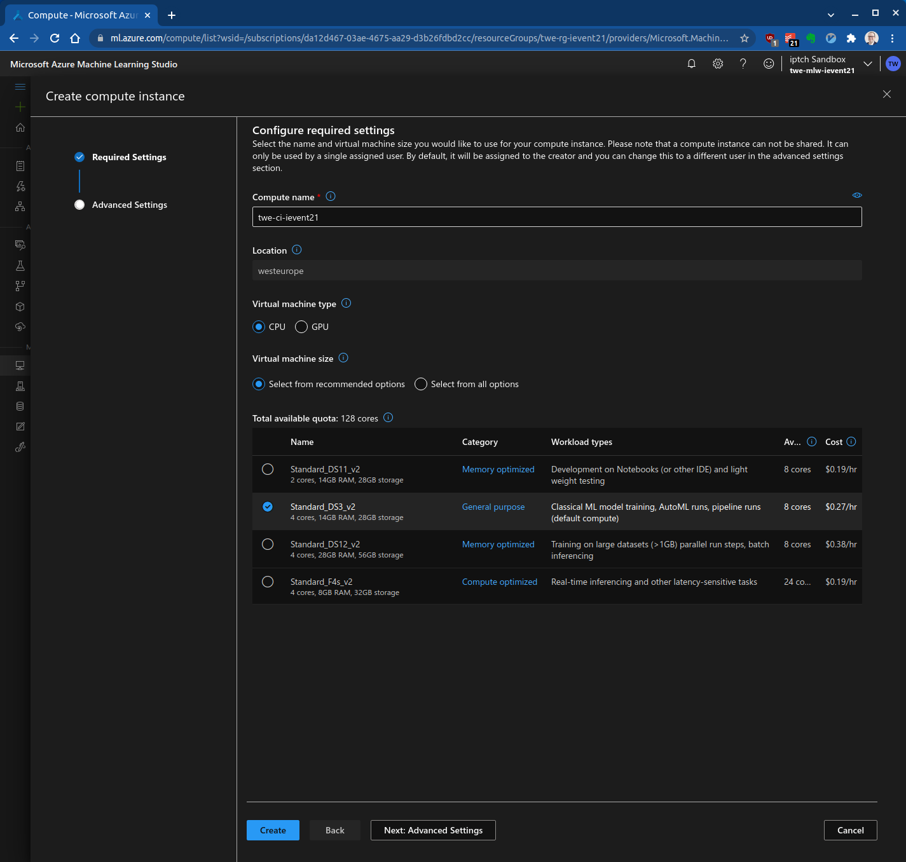
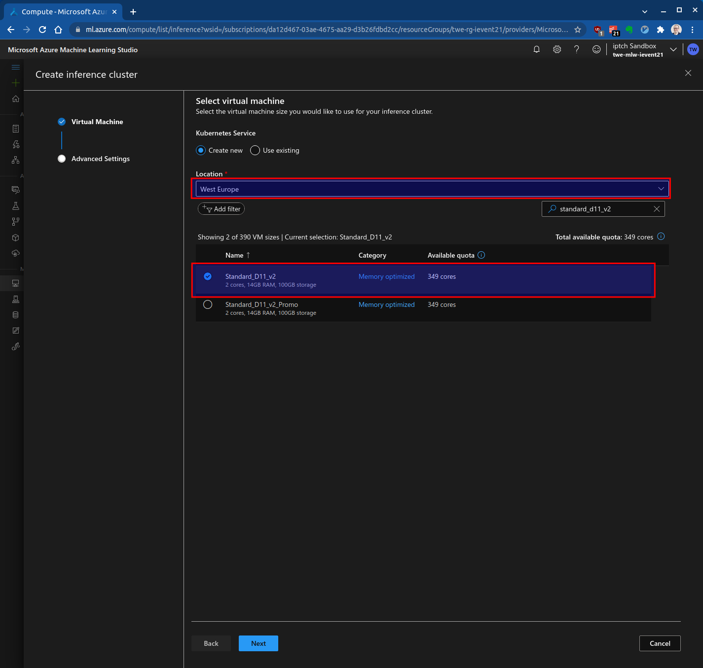
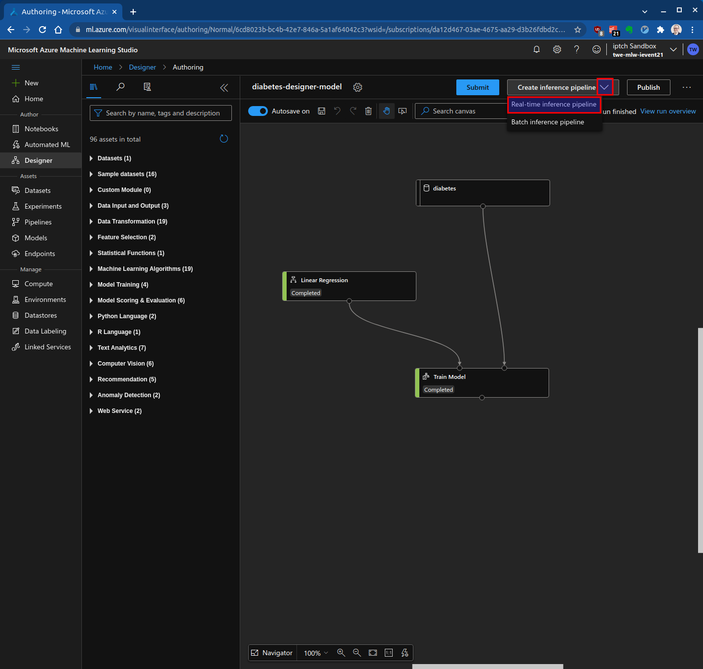
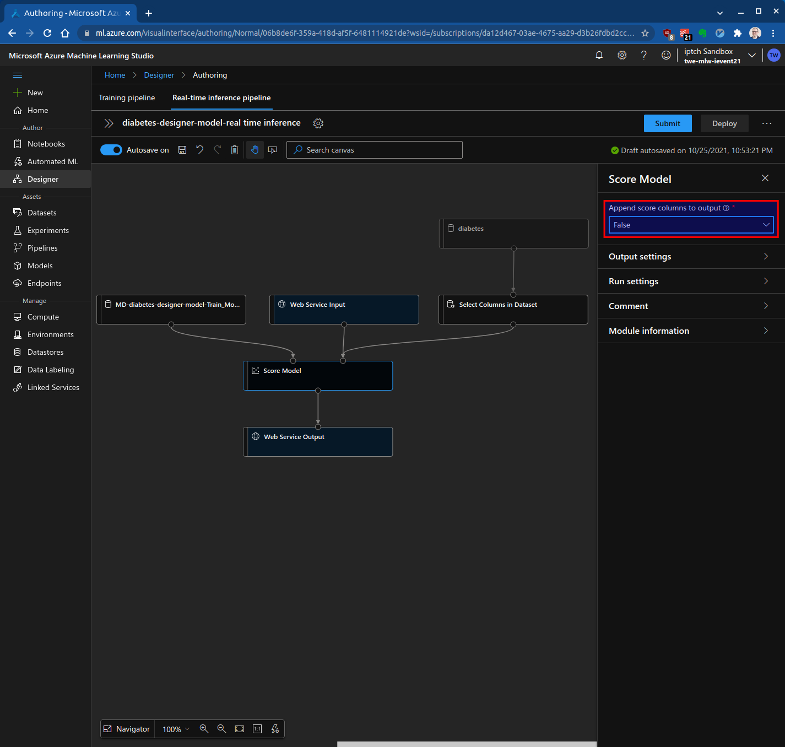
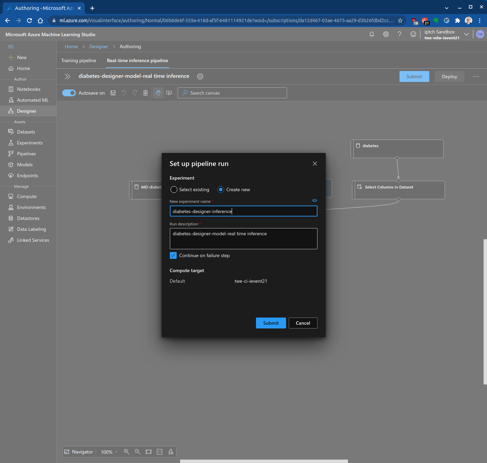
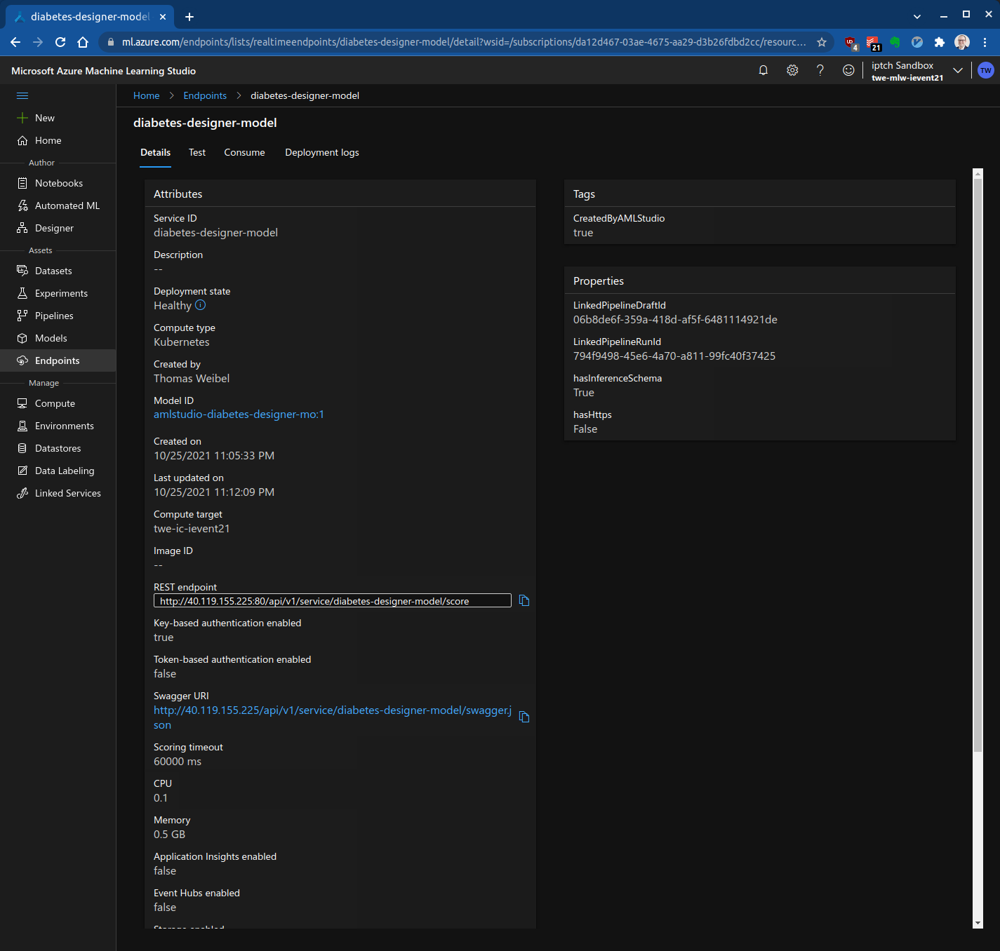

# Azure Machine Learning: Designer

|                      |                                                    |
| -------------------- | -------------------------------------------------- |
| **Fortgeschrittene** |  |

- [Einführung](#einführung)
- [Setup](#setup)
- [Erstellen einer Compute Instanz](#erstellen-einer-compute-instanz)
- [Erstellen eines Inference Clusters](#erstellen-eines-inference-clusters)
- [Erstellen eines Datensets](#erstellen-eines-datensets)
- [Erstellen eines Modells für Machine Learning mit Hilfe des Designers](#erstellen-eines-modells-für-machine-learning-mit-hilfe-des-designers)
- [Das Modell deployen](#das-modell-deployen)
- [Das Modell als Webservice aufrufen](#das-modell-als-webservice-aufrufen)
- [Referenzen](#referenzen)

## Einführung

In dieser Übung trainierst du ein Predictive Machine Learning Modell mit dem Azure Machine Learning Designer. Der Designer ist eine Low-Code-Drag-and-Drop-Benutzeroberfläche für Azure Machine Learning.

Du lernst dabei folgendes:

* Erstellen einer Azure Machine Learning Compute Instanz
* Erstellen eines Azure Machine Learning Inference Clusters
* Erstellen eines Datensatzes
* Trainieren eines Regressionsmodells
* Bereitstellung des Modells als Webservice
* Aufrufen des Modells als Webservice

## Setup

Du brauchst einen Azure Machine Learning Workspace. Falls du noch keinen erstellt hast, findest du in der [AutoML Anleitung](../auto_ml/README.md#setup) mehr Informationen dazu.

## Erstellen einer Compute Instanz

In diesem Abschnitt erstellst du eine Compute Instanz. Compute Instanzen werden zum Trainieren von Modellen für Machine Learning verwendet. Du erstellst auch einen Inference Cluster, um das bereitgestellte Modell für die Echtzeitbewertung zu hosten.

Melde dich beim [Azure Machine Learning Studio ](https://ml.azure.com/) an und wähle im Menü auf der linken Seite "Compute" und dann "New":






Die Compute Instanz kann auch zum Erstellen und Ausführen von Notebooks verwendet werden.

Die Bereitstellung der Maschine dauert etwa 4 Minuten.

## Erstellen eines Inference Clusters

Während du wartest, du den Inference Cluster auf der Registerkarte "Inference clusters" erstellen:


Wähle die Region "West Europe" und die VM Grösse "Standard_D11_v2":



Gib dem Cluster einen Namen, wähle "Dev-test" und konfiguriere die Anzahl Nodes auf "2":


Die Bereitstellung des Clusters dauert etwa 4 Minuten.

## Erstellen eines Datensets

Falls du das Diabetes Datenset noch nicht erstellt hast, findest du in der [AutoML Anleitung](../auto_ml/README.md#erstellen-eines-datensets) mehr Informationen dazu.

## Erstellen eines Modells für Machine Learning mit Hilfe des Designers

Nachdem du die Compute Instanzen und das Dataset erstellt hast, kannst du den Designer verwenden, um das Modell für Machine Learning zu erstellen. Wähle dazu den Azure Machine Learning Studio Designer und klicke auf "Easy-to-use prebuilt modules":


Konfiguriere das "Default compute target" und aktualisiere den "Draft name":


Ziehe das vorher erstellte Diabetes Dataset auf die Arbeitsfläche (Canvas):


Füge die folgenden Komponenten zur Arbeitsfläche hinzu:

* Linear Regression (befindet sich unter "Machine Learning Algorithms")
* Train Model (zu finden in "Model Training")

Die Kreise oben und unten an den Komponenten sind Ports. Aktuell sind die Komponenten noch nicht verbunden:


Verbinde nun die Komponenten miteinander:

* Wähle den Anschluss am unteren Ende des "diabetes" Datasets und ziehe ihn auf den Anschluss an der oberen rechten Seite der Komponente "Train Model"
* Wähle den Anschluss am unteren Ende der Komponente "Lineare Regression" und ziehe ihn auf den Anschluss an der oberen linken Seite der Komponente "Train Model"


Abschliessend muss noch die Zielvariable in der Komponente "Train Model" konfiguriert werden:


Nun kann das Modell submitted werden:


Der erste Durchlauf des Experiments sollte etwa 5 Minuten dauern. Nachfolgende Durchläufe sind viel schneller, da der Designer Komponenten, die bereits ausgeführt wurden, im Cache speichert, um die Latenzzeit zu verringern.

Wenn das Experiment beendet ist, sieht der Designer wie folgt aus:


## Das Modell deployen

Um das Modell bereitzustellen, wähle oben im Arbeitsbereich (Canvas) "Create inference pipeline > Real-time inference pipeline":



Die Pipeline wird auf die Komponenten reduziert, die für das Scoring des Modells erforderlich sind. Wenn die Daten gescored werden, sind die Werte der Target Variablen nicht bekannt. "Y" kann also aus dem Datensatz entfernt werden.

Um "Y" zu entfernen, füge dem Arbeitsbereich eine Komponente "Select Columns in Dataset"  (zu finden in "Data Transformation") hinzu. Verknüpfen die Komponente so, dass des Diabetes Dataset die Eingabe ist. Die Ergebnisse sind die Ausgabe für die Komponente "Score Model":


Markieren im Arbeitsbereich die Komponente "Select Columns in Dataset" und wähle dann "Edit Columns".

Wähle im Dialogfeld "Select columns" die Option "By name" und selektiere alle Input Variablen. Stelle sicher, dass die Target Variable "Y" nicht ausgewählt ist:


Wähle schliesslich die Komponente "Score Model" und stelle sicher, dass "Append score columns to output" auf "False" gestellt ist:



Nun kann das die Inference Pipeline submitted werden:



Nachdem die Inference Pipeline erfolgreich ausgeführt wurde, kann das Modell auf dem Inference Cluster bereitgestellt werden:


## Das Modell als Webservice aufrufen

Es dauert einige Minuten bis der Endpoint bereit ist. Gehe zu "Endpoint" und wähle "my-diabetes-model" aus:



Standardmässig wird beim Endpoint die schlüsselbasierte Authentifizierung aktiviert. Um den Service aufzurufen, benötigst du die Informationen in der Registerkarte "Consume":


Hier findest du auch Beispielcode in C#, Python und R. [diabetes_client.py](diabetes_client.py) ist eine Python Beispielsapplikation und ruft den Webservice auf:

```bash
python diabetes_client.py
```

## Referenzen

* [Azure Machine Learning documentation](https://docs.microsoft.com/en-us/azure/machine-learning/)
* [Manage Azure Machine Learning workspaces in the portal or with the Python SDK](https://docs.microsoft.com/en-us/azure/machine-learning/how-to-manage-workspace?tabs=azure-portal)
* [Diabetes Data](https://www4.stat.ncsu.edu/~boos/var.select/diabetes.html)
* [Consume an Azure Machine Learning model deployed as a web service](https://docs.microsoft.com/en-us/azure/machine-learning/how-to-consume-web-service?tabs=python)
