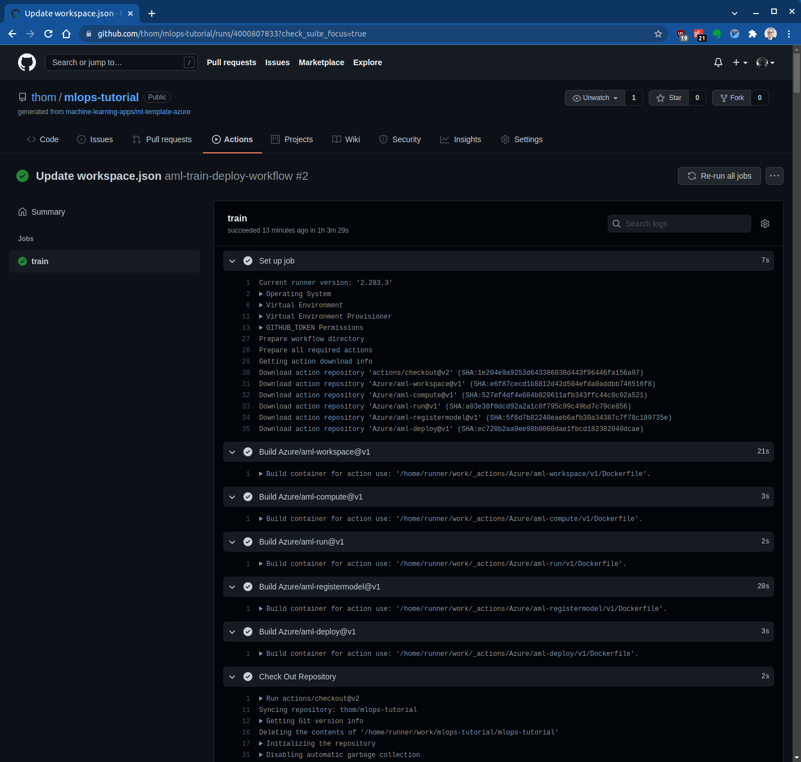

# MLOps: GitHub Actions

|              |                                   |            |
| ------------ | --------------------------------- | ---------- |
| **Experten** |  | 90 Minuten |

- [Einführung](#einführung)
- [Setup](#setup)
- [GitHub Workflow](#github-workflow)
- [Repository erstellen](#repository-erstellen)
- [Erstellen der Credentials für das Deployment](#erstellen-der-credentials-für-das-deployment)
- [GitHub Secret konfigurieren](#github-secret-konfigurieren)
- [Workspace Parameter definieren](#workspace-parameter-definieren)
- [Code ändern](#code-ändern)
- [Anzeigen der Ressourcen](#anzeigen-der-ressourcen)
- [Ressourcen aufräumen](#ressourcen-aufräumen)
- [Referenzen](#referenzen)

## Einführung

Der klassische Weg, um MLOps auf Azure einzurichten ist mit Azure DevOps und Azure Pipelines (siehe [MLOps with Azure ML](https://github.com/Microsoft/MLOpsPython)).

Dieses Tutorial verwendet GitHub Actions, um ein Modell auf Azure Machine Learning zu trainieren.

## Setup

Ausser einem Azure Account benötigst du für dieses Tutorial einen GitHub Account. [Erstelle einen](https://github.com/join), falls du noch keinen hast.

## GitHub Workflow

Ein Workflow wird durch eine YAML-Datei (`.yml`) im Pfad `/.github/workflows/` in deinem Repository definiert. Diese Definition enthält die verschiedenen Schritte und Parameter, aus denen der Workflow besteht.

## Repository erstellen

Erstelle ein neues Repository aus dem [ML Ops with GitHub Actions and Azure Machine Learning](https://github.com/machine-learning-apps/ml-template-azure) Template:

1. Öffne das [Template](https://github.com/machine-learning-apps/ml-template-azure) auf GitHub
2. Wähle ["Use this template"](https://github.com/machine-learning-apps/ml-template-azure/generate)

    

3. Erstelle ein neues Repository mit der Vorlage. Setze den Namen des Repositorys auf `mlops-tutorial` oder einen Namen deiner Wahl

## Erstellen der Credentials für das Deployment

Du kannst einen [Service Principal](https://docs.microsoft.com/en-us/azure/active-directory/develop/app-objects-and-service-principals#service-principal-object) mit dem Befehl [`az ad sp create-for-rbac`](https://docs.microsoft.com/en-us/cli/azure/ad/sp?view=azure-cli-latest#az_ad_sp_create_for_rbac) in der [Azure CLI](https://docs.microsoft.com/en-us/cli/azure/) erstellen.

Führe den folgenden Befehl mit der [Azure Cloud Shell](https://shell.azure.com/) im Azure Portal aus:

```bash
az ad sp create-for-rbac --name "<app-name>" --role contributor \
    --scopes /subscriptions/<subscription-id>/resourceGroups/<group-name> \
    --sdk-auth
```

Ersetze im obigen Beispiel die Platzhalter durch den Namen der App, den Service Principal Namen, deine Subscription ID und den Namen der Ressourcengruppe. Falls du noch keine eigene Ressourcengruppe hast, musst du zuerst eine erstellen. Verwende folgende Naming Conventions und benutze dein ipt-Kürzel als Prefix:

| Asset Type     | Abkürzung | Beispiel        |
| -------------- | --------- | --------------- |
| Resource Group | rg        | twe-rg-ievent21 |


Die Ausgabe von `az ad sp create-for-rbac` ist ein JSON-Objekt mit den Credentials für die Rollenzuweisung. Kopiere dieses JSON-Objekt für später (siehe [GitHub Secret konfigurieren](#github-secret-konfigurieren)).

```bash
  {
    "clientId": "<GUID>",
    "clientSecret": "<GUID>",
    "subscriptionId": "<GUID>",
    "tenantId": "<GUID>",
    (...)
  }
```

## GitHub Secret konfigurieren

Gehe zu deinem GitHub Repository und wähle "Settings > Secrets > New repository secret".

Füge die gesamte JSON-Ausgabe `az ad sp create-for-rbac` als Wert ein. Gib dem Geheimnis den Namen `AZURE_CREDENTIALS`:


## Workspace Parameter definieren

Du musst die Parameter in der Datei `/.cloud/.azure/workspace.json` in deinem Repository ändern, damit die GitHub Actions den gewünschten Azure Machine Learning Workspace erstellen oder sich mit ihm verbinden. 

Verwende für den Parameter `resource_group` denselben Wert, den du bei der Erstellung der Azure Credentials verwendet hast. Wenn du bereits einen Azure Machine Learning Workspace in dieser Ressourcengruppe hast, ändere den Parameter `name` in der JSON-Datei in den Namen deines Workspace. Wenn du möchtest, dass die Aktion einen neuen Workspace in dieser Ressourcengruppe erstellt, wähle einen Namen für deinen neuen Workspace und weise ihn dem Parameter `name` zu. Du kannst den Parameter `name` auch löschen, wenn du möchtest, dass die Aktion den Standardwert, also den Namen des Repositorys, verwendet.

Sobald du deine Änderungen in der Datei gespeichert hast, wird der vordefinierte GitHub-Workflow ausgelöst, der ein Modell auf Azure Machine Learning trainiert und bereitstellt. Überprüfe die Registerkarte "Actions", um zu sehen, ob deine Aktionen erfolgreich ausgeführt wurden:



Das erste Training und Deployment dauert circa 75 Minuten. Nachfolgende Trainings und Deployments werden schneller ausgeführt, weil die Infrastruktur schon besteht und nicht mehr neu erstellt werden muss.

## Code ändern

Jetzt kannst du damit beginnen, den Code im Folder `code` zu ändern, damit dein Modell und nicht das mitgelieferte Beispielmodell auf Azure trainiert wird.

Kommentiere die Zeilen 41 bis 57 in deiner `/.github/workflows/train_deploy.yml`, wenn du das Modell nur trainieren und nicht deployen willst. Entferne die Kommentare in den Zeilen 7 bis 8, wenn du den Workflow nur starten willst, wenn du Änderungen an Dateien im Folder `code` vornimmst.

## Anzeigen der Ressourcen

Die Logs deiner GitHub Actions enthalten URLs, mit denen du die Ressourcen, die in Azure Machine Learning Studio erstellt wurden, einsehen kannst. Alternativ kannst du auch das Machine Learning Studio besuchen, um den Fortschritt deiner Läufe usw. zu sehen:


## Ressourcen aufräumen

Wenn deine Ressourcengruppe und dein Repository nicht mehr benötigt werden, löschst du die Ressourcen, die du bereitgestellt hast, indem du die Ressourcengruppe und dein GitHub-Repository löschst.

## Referenzen

* [Use GitHub Actions with Azure Machine Learning](https://docs.microsoft.com/en-us/azure/machine-learning/how-to-github-actions-machine-learning)
* [ML Ops with GitHub Actions and Azure Machine Learning](https://github.com/machine-learning-apps/ml-template-azure)
* [MLOps on Azure](https://github.com/microsoft/MLOps)
* [GitHub Action for creating or connecting to Azure Machine Learning Workspace](https://github.com/Azure/aml-workspace)
* [GitHub Action for creating compute targets for Azure Machine Learning](https://github.com/Azure/aml-compute)
* [GitHub Action for training Machine Learning Models using Azure](https://github.com/Azure/aml-run)
* [GitHub Action for Registering a Machine Learning Model in Azure](https://github.com/Azure/aml-registermodel)
* [GitHub Action for deploying Machine Learning Models to Azure](https://github.com/Azure/aml-deploy)
